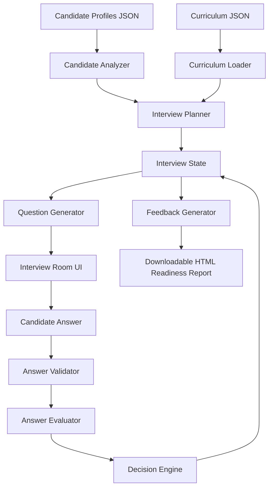
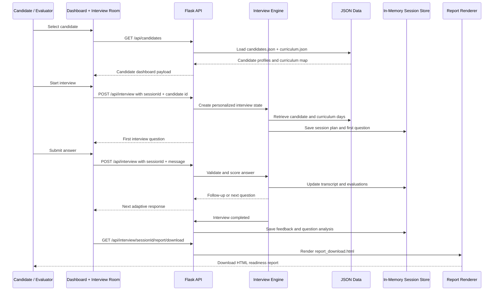

# InterviewOS

Adaptive AI technical interviewer for AI Cohort graduates.

## Overview

InterviewOS is a text-first AI Interview Agent that conducts personalized technical interviews based on a learner's 31-day AI Cohort journey.

The system reads the provided curriculum and candidate profile JSON files, creates a candidate-specific interview plan, asks adaptive technical questions, evaluates answers, maintains interview context, and generates a structured AI Engineering Readiness Report.

## Problem

AI Cohort learners complete hands-on work across topics such as Retrieval-Augmented Generation, Vector Databases, Prompt Engineering, Agentic AI, Model Context Protocol, AI Deployment, and Production AI Systems.

After completing the cohort, learners still need practice explaining their systems, tradeoffs, debugging approach, and engineering decisions in a technical interview setting.

## Solution

InterviewOS turns each learner profile into a realistic adaptive interview.

Instead of asking the same static questionnaire to every candidate, the backend analyzes completed and weak curriculum areas, plans interview topics from the curriculum JSON, asks personalized technical questions, adapts with follow-up questions based on responses, evaluates answer quality, tracks the session by `sessionId`, and produces structured feedback with a downloadable report.

## Architecture



## Data Flow



## Key Features

- Candidate dashboard generated from `data/candidates.json`
- Curriculum-grounded interview planning from `data/curriculum.json`
- Required `POST /api/interview` endpoint
- Candidate-specific interview rooms
- 10-question adaptive interview flow
- Coverage across multiple curriculum days
- Follow-up questions based on previous answers
- Gibberish and invalid answer detection
- Weak answer handling for uncertainty such as "I am not sure"
- Structured feedback with summary, strengths, gaps, and next steps
- Downloadable HTML AI Engineering Readiness Report
- Optional audio/video interview-room layer preserved as an enhancement

## Tech Stack

- Flask
- Flask-SocketIO
- Pydantic
- Vanilla HTML/CSS/JavaScript
- In-memory Python session store
- JSON-based curriculum and candidate data
- Optional Sarvam AI STT/TTS utilities for voice features

## API Contract

### Start Interview

```http
POST /api/interview
```

```json
{
  "sessionId": "CAND-001-ABCD",
  "candidate": {
    "id": "CAND-001"
  }
}
```

### Continue Interview

```json
{
  "sessionId": "CAND-001-ABCD",
  "message": "Embeddings convert text into vector representations that preserve semantic meaning."
}
```

### Completed Interview Response

```json
{
  "reply": "Interview completed.",
  "done": true,
  "feedback": {
    "summary": "Candidate completed a 10-question adaptive interview...",
    "strengths": [],
    "gaps": [],
    "next": []
  }
}
```

## Main Routes

```text
GET  /
GET  /dashboard
GET  /api/candidates
POST /api/interview
POST /api/interview/create
GET  /interview/<room_id>
GET  /api/interview/<room_id>/report/download
```

## Demo Flow

1. Open the landing page.
2. Go to the candidate dashboard.
3. Select a candidate profile.
4. Start the adaptive interview.
5. Answer the technical questions.
6. Review final structured feedback.
7. Download the AI Engineering Readiness Report.

## Run Locally

```bash
pip install -r requirements.txt
python app.py
```

Open:

```text
http://localhost:5000
```

## Environment Variables

Create a local `.env` file if using optional voice features.

```env
FLASK_SECRET_KEY=your-local-secret
SARVAM_API_KEY=optional-for-voice-features
```

The core text interview works without voice features.

## Project Scope

Included:

- adaptive interview flow
- candidate dashboard
- curriculum-grounded planning
- answer validation and scoring
- multi-turn session memory
- structured feedback
- downloadable report

Out of scope:

- user authentication
- persistent user accounts
- long-term database history
- mobile app
- required voice interaction

## AI Usage

AI assistance was used during planning, implementation, debugging, testing, and documentation. See `PROMPTS.md` for the AI usage log.

## Attribution

InterviewOS was built during the hackathon by extending a pre-existing Flask interview-room prototype that included optional audio/video utilities. The adaptive interview engine, curriculum and candidate JSON integration, candidate dashboard, answer validation, scoring, feedback generation, and downloadable readiness report were implemented for this hackathon.

## Documentation

- [Architecture](ARCHITECTURE.md)
- [AI Usage Log](PROMPTS.md)
- [Technical Specification](technical-spec.md)

## Contributors

- [Suzanne Daniel Thomas](https://github.com/suzannet-menon)
- [Ruchira Jagshettiwar](https://github.com/ruchirajags)
